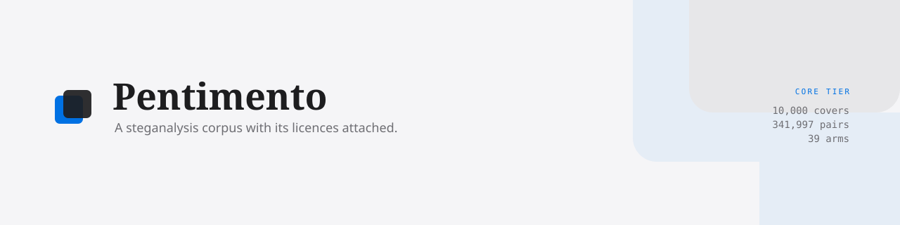
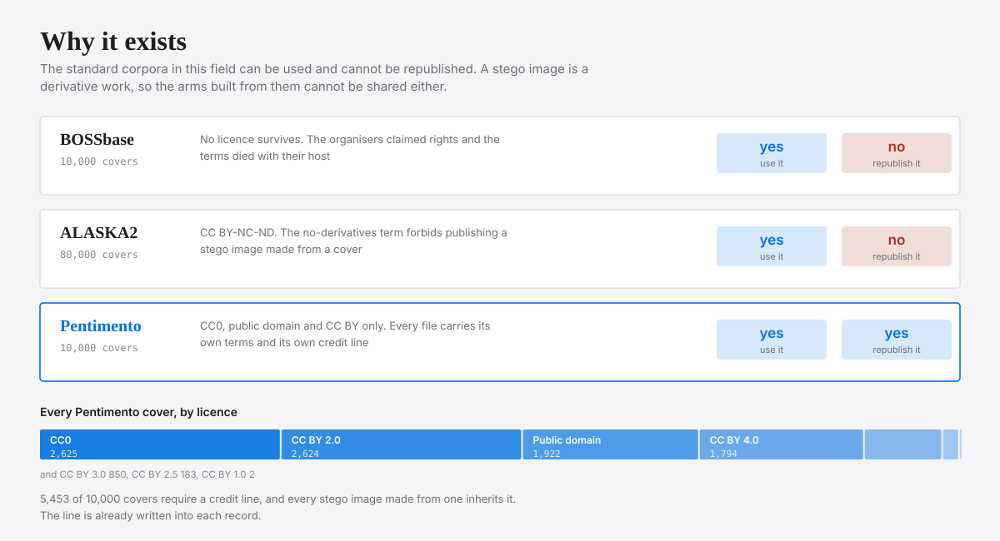
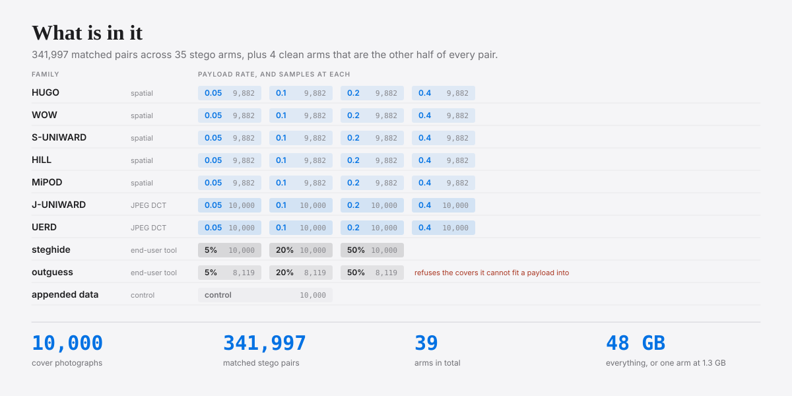
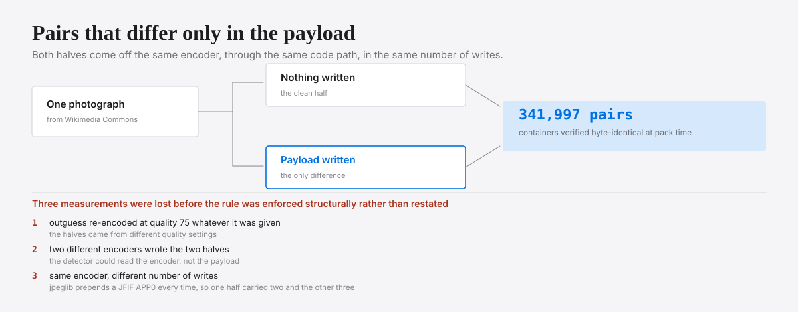

<picture>
  <source media="(prefers-color-scheme: dark)" srcset="brand/social/readme-banner-1280x320-dark.svg">
  
</picture>

# Pentimento

**A steganalysis corpus you are allowed to republish.**

10,000 cover photographs and 344,357 matched stego pairs. Every image carries
its own licence, its own credit line and its own checksum, so a result measured
on it can be traced back to the photograph it came from.

[Get it](https://archive.org/details/pentimento-core-v1) ·
[Documentation](https://elementmerc.github.io/pentimento/) ·
[What is in it](https://elementmerc.github.io/pentimento/guide/whats-in-it) ·
[Limitations](https://elementmerc.github.io/pentimento/guide/limitations)

---

## Why it exists

The standard corpora in this field can be used and cannot be republished, and a
stego image is a derivative work, so the arms built from them cannot be shared
either. That is not a licensing technicality: it is why steganalysis results are
so hard to reproduce.

<picture>
  <source media="(prefers-color-scheme: dark)" srcset="docs/media/02-why-it-exists-dark.svg">
  
</picture>

Pentimento reaches BOSSbase's cover count by matching it, not by containing any
of it. 5,453 of the 10,000 covers require a credit line, and the line is already
written into every record, so complying is mechanical rather than a research
project of its own.

## What is in it

<picture>
  <source media="(prefers-color-scheme: dark)" srcset="docs/media/01-what-is-in-it-dark.svg">
  
</picture>

Seven adaptive schemes across four payload rates, the two end-user tools people
actually run, and an appended-data control that anything claiming to detect
steganography should find trivially. Shards are grouped one set per arm,
so evaluating against WOW at 0.2 bits per pixel does not mean downloading MiPOD
to get it.

outguess is the one short arm, 8,119 rather than 10,000: it refuses covers it
cannot fit a payload into, and the ones it refuses are the small and the busy
covers. An outguess arm is therefore a different cover distribution from a full
one, which matters when you compare across arms.

Three nested tiers: **Nano** (200 covers, 1.0 GB), **Lite** (1,000, 4.8 GB) and
**Core** (10,000, 48 GB). A tier is the first *n* covers of one fixed ordering,
so a smaller tier is exactly a prefix of a larger one, byte for byte. Core is
the tier published on the Internet Archive today; Nano and Lite are built and
packed and are not up yet.

## Pairs that differ only in the payload

<picture>
  <source media="(prefers-color-scheme: dark)" srcset="docs/media/03-matched-pairs-dark.svg">
  
</picture>

If the clean and stego halves differ in any other way, a resave, a different
quantisation table, a stripped timestamp, then a detector can score well by
recognising that difference and the result says nothing about steganography.
Three measurements were lost to exactly this before the rule was enforced
structurally: the packer parses both halves down to the scan and refuses any
pair whose containers differ.

## Getting one arm

```bash
BASE=https://archive.org/download/pentimento-core-v1

# The paperwork first: it is small and it tells you what the rest is.
# -L follows the Archive's redirect to a storage node, -f turns a 404 into an
# error instead of a file containing the error page.
curl -fLsO $BASE/README.md -O $BASE/SHA256SUMS-covers -O $BASE/SHA256SUMS-arms -O $BASE/load_pentimento.py

# One arm, and the clean half it is measured against. About 130 MB.
curl -fLO $BASE/pentimento-core-wow-0200-00000.tar
curl -fLO $BASE/pentimento-core-clean-grey-00000.tar

# Check what arrived. A shard that fails here changed in transit.
grep -E 'wow-0200-00000|clean-grey-00000' SHA256SUMS-arms | sha256sum -c

# Read it. Nothing to install.
python3 load_pentimento.py pentimento-core-wow-0200-00000.tar
```

Read [Loading and splitting](https://elementmerc.github.io/pentimento/guide/using-it)
before training on it. A random split puts a photograph and its own stego
version on both sides and quietly flatters your results.

## Before you publish a number from it

Pentimento's covers are photographs, so they were JPEG compressed before they
reached the corpus. BOSSbase's were captured raw. **Pentimento numbers and
BOSSbase numbers do not belong in the same table**, and the other limitations
that change what a result means are listed in full under
[Limitations](https://elementmerc.github.io/pentimento/guide/limitations).

## About this repository

This is the corpus: its documentation, its release metadata and the record of
how it was made. The images themselves are published to the Internet Archive,
HuggingFace and Kaggle, because 48 GB does not belong in git.

It is built by [stegobench](https://github.com/elementmerc/stegobench), which is
the harness. The figures above are drawn by `tools/make_figures.py` from the
corpus's own measured numbers; `--check` fails if they have drifted.

## Licence

**The corpus** is CC BY 4.0, and each file carries its own terms in its own
record. See [Licence and attribution](https://elementmerc.github.io/pentimento/guide/licence).

**This repository** holds four different kinds of thing and they are not all
under one licence: code is AGPL-3.0-or-later, the documentation prose is
CC BY 4.0, the identity in `brand/` is reserved with a narrow permission to
use the mark unmodified when referring to this project, and the webfonts under
`docs/public/fonts/` are OFL 1.1. The reasoning, and the exact permission for
the mark, are in [LICENCES-IN-THIS-REPOSITORY.md](LICENCES-IN-THIS-REPOSITORY.md).
